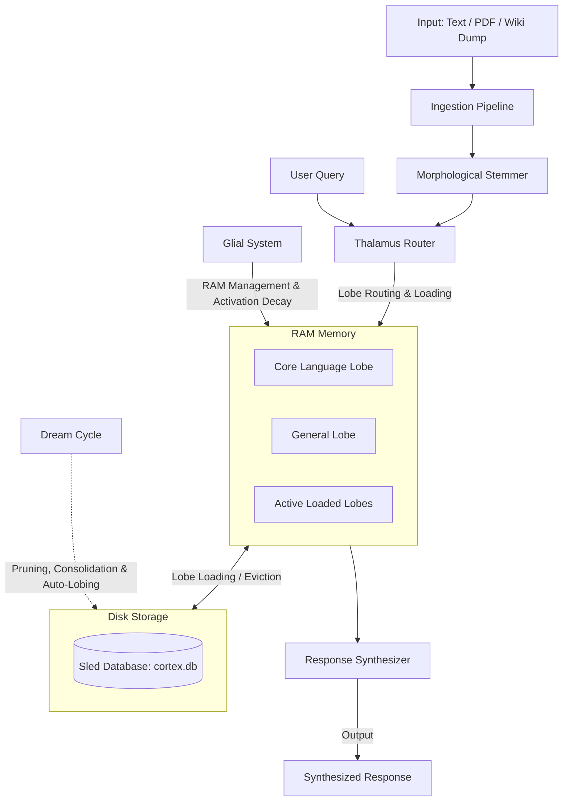

# Cortex Engine: Pure Graph & Partitioned Memory System

**Cortex Engine** is a passive and pure associative/semantic graph and partitioned memory engine that mimics the working principles and neurological structures of the human brain **without using artificial intelligence or neural network weights.**

Developed in Rust, this system models data as semantic sentence segments (neurons) and the associative/sequential connections between them (synapses). It features glial cells that dynamically manage the RAM budget, autonomous sleep/dream cycles (plasticity, pruning, and auto-lobing), and Turkish morphological analysis capabilities.

---

## 🧠 Core Architecture & Working Principle

Instead of holding the entire database as a single massive graph in memory, Cortex Engine manages data in **partitioned lobes**, similar to the lobe structure of the brain. Each lobe contains its own neurons and their synapses.



---

## 📂 Modules & Components

The system is organized into the following modules under `/src`:

### 1. [cortex_graph.rs](src/cortex_graph.rs) (Core Graph Structure)
* **ConceptNode (Neuron)**: Represents ideas, sentences, code blocks, or equations. Each node has an activation level (`activation_level`), keyword weights (`tags`), and an associated lobe name (`lobe_name`).
* **Synapse**: Connects neurons. There are two synapse types:
  * `Sequential`: Temporal/sequential flow connections (A -> B).
  * `Semantic`: Associative and conceptual connections (A <-> C).
* **Lobe Partitioning**: The graph is split into lobes that are loaded/unloaded dynamically to respect RAM constraints. Inactive lobes are serialized (using `bincode`) and persisted in **Sled DB** (a high-performance key-value store).

### 2. [thalamus_router.rs](src/thalamus_router.rs) (Thalamus Router)
* Analyzes query keywords to determine which lobes stored in the database should be loaded into RAM.
* Connects Turkish synonyms to English conceptual bridges.
* **Lobe-Wide Spiking**: For technical queries, it automatically triggers and excites base concepts and code nodes in target lobes.

### 3. [glial_system.rs](src/glial_system.rs) (Glial RAM Manager)
* Limits the maximum number of external lobes loaded in RAM simultaneously.
* Damps (`decay_rate`) neuron activation levels after queries.
* If the RAM limit is exceeded, it automatically evicts the lobe with the lowest total activation to the Sled DB.

### 4. [dream_cycle.rs](src/dream_cycle.rs) (Sleep & Plasticity Cycle)
* **Synaptic Plasticity (Hebbian Learning)**: Strengthens synapse weights between co-firing neurons while weakening inactive connections.
* **Pruning**: Removes weak synapses from the graph whose weights drop below a specified threshold (`prune_threshold`).
* **Automatic Lobing**: Analyzes isolated neurons in the `general` lobe, clusters them based on strong connections using BFS, and autonomously packages them into new specialized lobes (e.g., `quantum`, `rust`, `math`).

### 5. [ingestion.rs](src/ingestion.rs) (Data Ingestion Pipeline)
* Splits incoming text into logical sentence chunks based on length constraints (`SentenceChunker`).
* Extracts keywords and weights for each chunk to generate new concept nodes.
* Inserts `Sequential` synapses between successive chunks to preserve narrative flow.

### 6. [pdf_ingestor.rs](src/pdf_ingestor.rs) (PDF Parser)
* Extracts text cleanly from PDF files using `pdf-extract` and `lopdf`.
* Filters out page numbers, recurring headers/footers, table of contents lines, and collapsed layouts containing garbled text.

### 7. [wiki_parser.rs](src/wiki_parser.rs) (Wikipedia Dump Processor)
* Reads massive Turkish Wikipedia dump files in `.xml` or compressed `.xml.bz2` formats.
* Parses pages concurrently using `rayon` and feeds them as semantic lobes into the database.

### 8. [morphology.rs](src/morphology.rs) (Turkish Morphological Analyzer)
* Employs a rules-based stemmer to resolve Turkish word stems, which is essential for agglutinative languages.
* Correctly handles Turkish-specific casing rules (`İ` -> `i`, `I` -> `ı`).
* Validates stemming based on active graph frequency statistics to prevent aggressive suffix trimming.

### 9. [synthesizer.rs](src/synthesizer.rs) (Response Synthesizer)
* **Deterministic Shield**: For technical queries demanding exact retrieval, it performs a shortest-path search (Neural Pathfinding) over activated nodes to preserve raw information integrity.
* **Creative Mode**: For creative queries, it utilizes speculative neural walks and Turkish morphological templates to synthesize novel sentence combinations.

---

## 🚀 Getting Started

### Prerequisites
* Rust toolchain (Cargo, rustc)
* System dependencies for PDF and Bzip2 parsing (usually pre-installed on most modern Linux distributions).

### Building
To compile the project in optimized release mode:

```bash
cargo build --release
```

### Running
Run the interactive menu interface:

```bash
cargo run --release
```

---

## 🛠️ Interactive Menu Options

Upon launching the application, you will be presented with the following menu:

1. **[1] Ingest and Scan Directory (`cortex_inputs/`)**: Automatically cleans, analyzes, and indexes any `.txt` or `.pdf` files dropped into the `cortex_inputs/` folder.
2. **[2] Manual Text Entry**: Allows you to type text directly into the terminal to create new nodes and semantic connections.
3. **[3] Query and Synthesize Response**: Triggers the Thalamus router, pulls target lobes into RAM, propagates node activation, and generates a response using the `Synthesizer`.
4. **[4] Dream/Idle Mode Optimization**: Cleans up RAM, consolidates/pruning synapses, and performs automated clustering of general nodes into new lobes.
5. **[5] Show Graph Status and RAM Active Lobes**: Reports currently loaded lobes, total node/edge counts, and RAM budget health.
6. **[6] Exit**: Flushes Sled DB writes and cleanly releases file locks.
7. **[7] Batch Process Wikipedia Dump**: Processes large Turkish Wikipedia XML dumps to seed the graph with global knowledge.

---

## 📦 Storage & Directory Structure

* **`cortex_storage/cortex.db`**: Sled database files storing the serialized lobes.
* **`cortex_inputs/`**: Source folder where PDF and TXT documents should be placed before running directory ingestion.

---

## 📜 License

This project is created for educational, research, and alternative AI cognitive architecture experimentation purposes.
